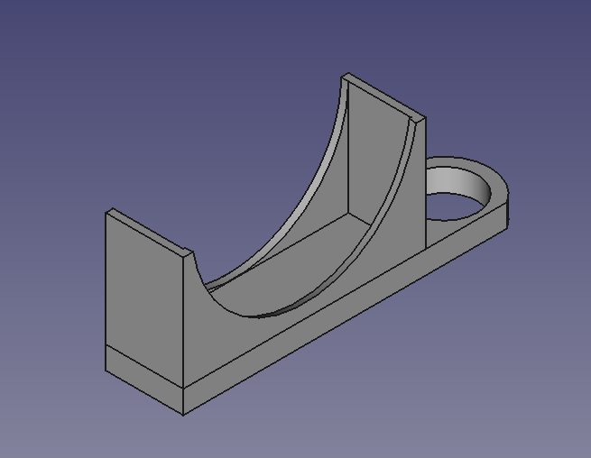

# PCB Scanner

This is a proof of concept: use an Anet A8 3D printer to scan
a PCB and create a very big image.

## Getting started

The main script is ``anet_scan.py``:

```
$ pip install pygame pyserial
$ python anet_scan.py <serial device path> <width in mm> <height in mm>
 ...
```

the resulting images are in the ``shoots/`` directory.

## Microscope holder

There is a ``FreeCAD`` design file named ``microscope_holder.fcstd`` for the microscope
holder.



The microscope used is [this](https://www.aliexpress.com/item/High-Quality-2-0-MP-HD-Android-phones-500X-USB-digital-microscope-electron-microscope-enlarge-for/32697275807.html)
but anyone would work as well.

## Stitching images

This is the hardest part: you could use [Hugin](http://hugin.sourceforge.net/) or [Imagej](ImageJ.net)
but with such large number of images it's unreliable; probably in future I will
create a script to mount them setting manually the offset between images.
